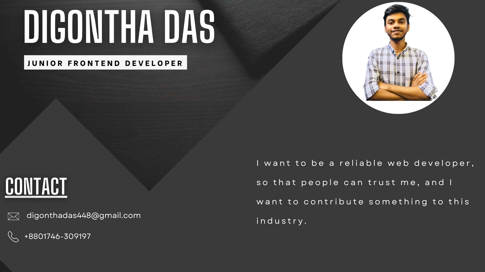

  

  <h1 align="center">
    <pre>
    ███╗   ███╗██╗███╗   ██╗███████╗██╗  ██╗███████╗███████╗███████╗
    ████╗ ████║██║████╗  ██║██╔════╝██║  ██║██╔════╝██╔════╝██╔════╝
    ██╔████╔██║██║██╔██╗ ██║███████╗███████║█████╗  ███████╗███████╗
    ██║╚██╔╝██║██║██║╚██╗██║╚════██║██╔══██║██╔══╝  ╚════██║╚════██║
    ██║ ╚═╝ ██║██║██║ ╚████║███████║██║  ██║███████╗███████║███████║
    ╚═╝     ╚═╝╚═╝╚═╝  ╚═══╝╚══════╝╚═╝  ╚═╝╚══════╝╚══════╝╚══════╝
    </pre>
  </h1>

  <h3 align="center">
    <i>Building Scalable Web Applications | MERN Stack Specialist | Performance-Driven Developer</i>
  </h3>

  
  
  

---

## 🎯 Who I Am

> **Full-Stack Developer** crafting high-performance web applications with clean code and modern architecture.

I specialize in building **scalable SaaS products** and **user-centric web applications** using the **MERN stack**. My focus is on delivering **production-ready solutions** that balance performance, maintainability, and exceptional user experience.

### 💡 What I Bring to the Table

- **Performance Optimization** – Fast, efficient, and scalable applications
- **Clean UI/UX Design** – Intuitive interfaces that users love
- **Modern Architecture** – Future-proof, maintainable codebases
- **Problem-Solving Mindset** – Turning complex ideas into elegant solutions

---

## 🚀 What I Do

### Frontend Development

### Backend Development

### State & Data Management

---

## 🛠️ Tech Stack

  

### Core Technologies

|       Category       | Tools & Frameworks                                  |
| :------------------: | :-------------------------------------------------- |
|     **Frontend**     | React, Next.js, TypeScript, Tailwind CSS, ShadCN UI |
|     **Backend**      | Node.js, Express.js, REST APIs                      |
|     **Database**     | MongoDB, Mongoose                                   |
| **State Management** | Redux Toolkit, React Query, Context API             |
|  **Authentication**  | JWT, OAuth, Firebase Auth                           |
|  **DevOps & Tools**  | Git, GitHub, Postman, Vercel                        |

---

## 🎯 Current Focus

- 🔥 Building **production-ready SaaS applications**
- 🌱 Expanding expertise in **cloud architecture & DevOps**
- 💼 Open to **international freelance projects** and **full-time opportunities**
- 📚 Continuously learning **advanced system design** and **microservices**

---

## 📊 GitHub Analytics

  <!-- GitHub Streak -->
  

  <!-- Top Languages -->
  

  

  <!-- GitHub Stats -->
  

---

## 🐍 Contribution Activity

  

---

## 💼 Featured Projects

  
<b>🎁 Click to expand</b>

### 🚀 [Project One](link) – _Brief description_

- **Tech Stack:** React, Node.js, MongoDB
- **Features:** Feature 1, Feature 2, Feature 3

   

### 🔥 [Project Two](link) – _Brief description_

- **Tech Stack:** Next.js, TypeScript, Tailwind
- **Features:** Feature 1, Feature 2, Feature 3

---

## 🤝 Let's Connect

I'm always open to discussing **new projects**, **creative ideas**, or **opportunities** to be part of your vision.

   

  

<i>⭐ Feel free to star my repos – it helps!</i>

---

**Built with ❤️ and lots of ☕ by [Digontha](https://github.com/Digontha)**

   

  

